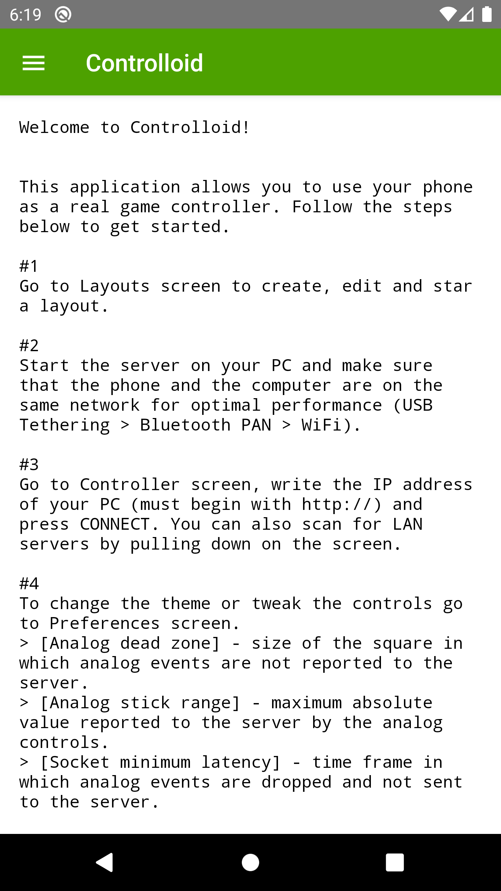
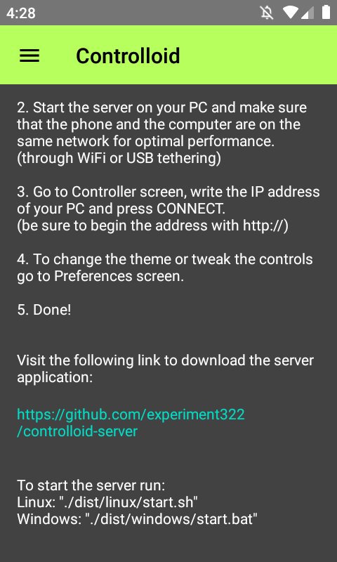
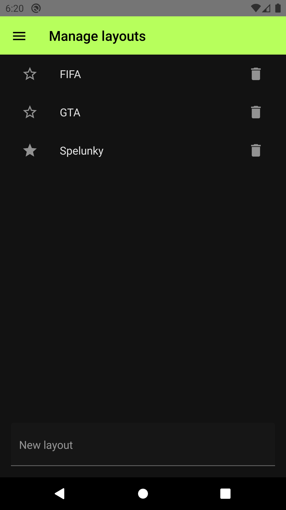
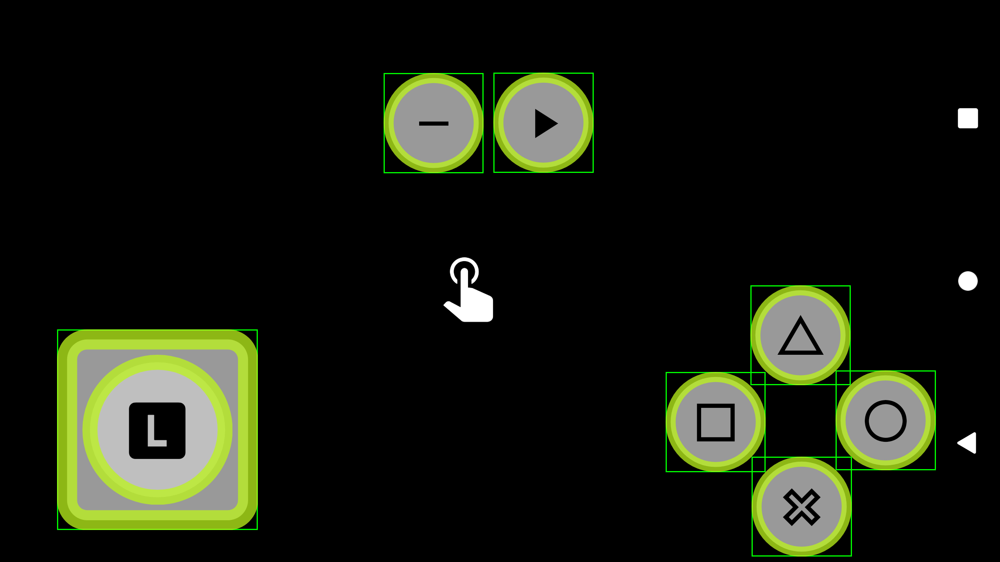
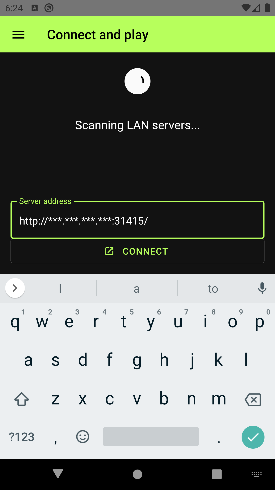
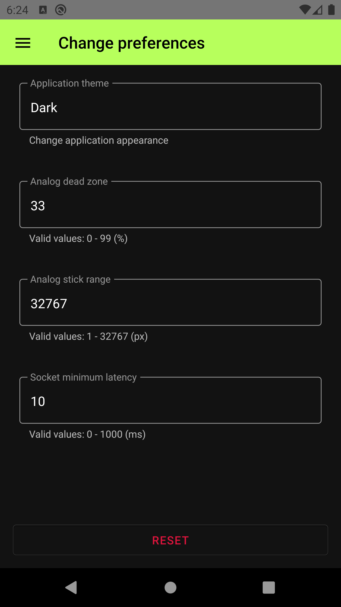

  

# controlloid-client
Controlloid is a small open source application that turns your phone into a
real game controller for your PC. It works on Linux and Windows and can
connect through anything that allows the creation of a LAN network: WiFi,
Bluetooth, USB etc. It works over internet too, but for optimal performance
it is recommended to create a hotspot on your PC and disable other network
connections (such as wired) which allows the connected devices to access
the internet.

The server application can be downloaded from the following link.

[controlloid-server](https://github.com/experiment322/controlloid-server)

## Features
* All the buttons of a PS2 controller (except L3 and R3)
* Supports multiple clients (limited to 16 on Windows)
* Analog stick dead zone (set from Preferences)
* Scan and connect instantly to LAN servers
* Move, resize and overlap buttons in layout editor
* Creation of multiple layouts to accommodate different games
* More to come! (suggestions welcome on GitHub)

## Screenshots

